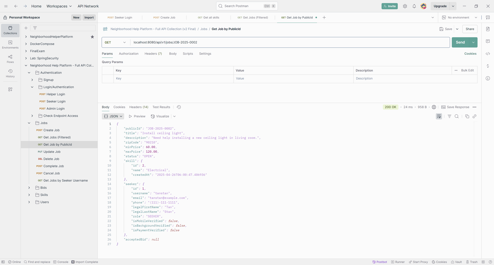

# Neighborhood Help Platform - Backend

---

## 🛠️ Project Description

The **Neighborhood Help Platform** connects people who need help (Seekers) with local people who can help (Helpers) — for tasks like moving furniture, fixing dishwashers, pet-sitting, and more. It's like an early version of TaskRabbit/Yelp, but hyper-local and designed for real neighborhoods.

---

## 🎯 Problem Statement

Many communities lack an efficient way for residents to request help or offer services in a trusted environment. Existing gig apps can be too expensive, impersonal, or limited. Our platform enables neighbors to connect directly, safely, and affordably.

Seekers can:

- Post jobs describing the task.
- Choose helpers based on bids, skills.

Helpers can:

- Browse open jobs.
- Place bids offering their services.
- Build their profile with skills and reviews. (Future Update)

The system ensures transparency, safety, and a sense of community trust.

---

## 📜 User Story

- As a **Seeker**, I want to post a job and receive bids from local helpers.
- As a **Helper**, I want to find jobs that match my skills and bid on them.
- As an **Admin**, I want to manage skill categories.
- As a **User**, I want to have a verified profile (mobile, payment, background). (Future Update)
- As a **System**, I want to track job statuses: Open, In Progress, Completed, Canceled.

---

## 📋 Use Cases

- Users register and authenticate securely with JWT.
- Seekers create and manage job posts.
- Helpers place, edit, or withdraw bids.
- Job lifecycle transitions through statuses.
- Skills/categories are managed (Admin only).
- Ratings and reviews improve trust.

---

## 🚀 Tech Stack

- **Backend:** Java 17, Spring Boot 3.4.4, Spring Security, Spring Data JPA
- **Database:** PostgreSQL / H2 (dev)
- **Authentication:** JWT Token Authentication
- **API Documentation:** Swagger UI (OpenAPI 3)
- **Build Tool:** Gradle (Kotlin DSL)
- **Testing:** JUnit 5, Mockito

---

## 🛠️ Setup Instructions

1. Clone the repository:

```bash
git clone https://github.com/XNKRJUNG/neighborhood-help-platform.git
```

2. Navigate to the project directory:

```bash
cd neighborhood-help-platform
```

3. Update `application.properties` if needed for database configs.
4. Build the project:

```bash
./gradlew clean build
```

5. Run the application:

```bash
./gradlew bootRun
```

---

## 📖 API Documentation

- **Swagger UI** available at:

```
http://localhost:8080/swagger-ui/index.html
```

- **OpenAPI Spec**:

```
http://localhost:8080/v3/api-docs
```

---

## 🧩 ER Diagrams

### Current Implementation


### Future Implementation Plan


---

## 📸 API tested and verified! 🚀

## 🔑 Authentication APIs

---

### Signup

Helper Signup


Seeker Signup


Admin Signup


### Login

Helper Login


Seeker Login


Admin Login


---

## 📆 Skills Management APIs

---

Get all Skills


Create Skill (Admin Only)


Update Skill (Admin Only)


Delete Skill (Admin Only)


---

## 💼 Jobs Management APIs

---

Create a Job (Seeker Only)


Get Jobs (Filtered)


Get Job by Public ID



Update a Job


Delete a Job


Complete a Job


Cancel a Job


Cancel a Completed Job (Error Case)


Duplicate Job Creation (Error Case)


---

### 🖋️ Bids Management APIs

---

Create Bid (Helper Only)


Get Bids for a Job (Seeker Only)


Accept a Bid (Seeker Only)


---

## 🤵🏼 User Management APIs

---

Get Current User Details (Authenticated)


Get All Users (Admin Only)


---

## ⚡ Future Enhancements

- Add background verification badge workflow.
- Implement messaging/chat between users.
- Payment processing integration (Stripe/Paypal).
- Mobile app frontend (React Native/Flutter).

---

## 🙋‍♂️ Solo Developer

This project is built solo by ["Cyrus" Yogesh Shrestha](https://github.com/XNKRJUNG) as a full-stack engineering exercise with real-world architecture to help the neighborhood.

---

# 🙌 THANK YOU!

---

Built with ❤️ for the neighborhood!